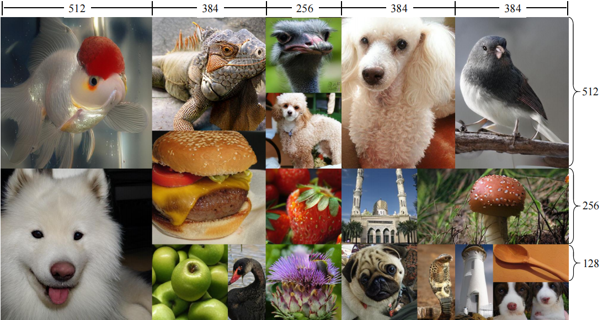

<div align="center">
<h1> FlexVAR: Flexible Visual Autoregressive Modeling without Residual Prediction</h1>
<h3></h3>

Siyu Jiao<sup>1</sup>, Gengwei Zhang<sup>2</sup>, Yinlong Qian<sup>3</sup>, Jiancheng Huang<sup>3</sup>, Yao Zhao<sup>1</sup>,  
Humphrey Shi<sup>4</sup>, Lin Ma<sup>3</sup>, Yunchao Wei<sup>1</sup>, Zequn Jie<sup>3</sup>

<sup>1</sup> BJTU, <sup>2</sup> UTS, <sup>3</sup> Meituan, <sup>4</sup> Georgia Tech


[](https://arxiv.org/abs/2502.20313)&nbsp;
[](https://huggingface.co/jiaosiyu1999/FlexVAR)&nbsp;


</div>

<div align="center">

</div>

## Introduction

This work challenges the residual prediction paradigm in visual autoregressive modeling and presents FlexVAR, a new Flexible Visual AutoRegressive image generation paradigm. FlexVAR facilitates autoregressive learning with ground-truth prediction, enabling each step to independently produce plausible images. This simple, intuitive approach swiftly learns visual distributions and makes the generation process more flexible and adaptable. **Trained solely on low-resolution images** ($\leq$ 256px), FlexVAR can: (1) Generate images of various resolutions and aspect ratios, even exceeding the resolution of the training images. (2) Support various image-to-image tasks, including image refinement, in/out-painting, and image expansion. (3) Adapt to various autoregressive steps, allowing for faster inference with fewer steps or enhancing image quality with more steps. Our 1.0B model outperforms its VAR counterpart on the ImageNet 256x256 benchmark. 
Moreover, when zero-shot transfer the image generation process with 13 steps, the performance further improves to 2.08 FID, outperforming state-of-the-art autoregressive models AiM/VAR by 0.25/0.28 FID and popular diffusion models LDM/DiT by 1.52/0.19 FID, respectively. When transferring our 1.0B model to the ImageNet 512x512 benchmark in a zero-shot manner, FlexVAR achieves competitive results compared to the VAR 2.3B model, which is a fully supervised model trained at 512x512 resolution.


## Installation

1. Install `torch>=2.0.0`.
2. Install other pip packages via `pip3 install -r requirements.txt`.
3. Prepare the [ImageNet](http://image-net.org/) dataset
    <details>
    <summary> assume the ImageNet is in `/path/to/imagenet`. It should be like this:</summary>

    ```
    /path/to/imagenet/:
        train/:
            n01440764: 
                many_images.JPEG ...
            n01443537:
                many_images.JPEG ...
        val/:
            n01440764:
                ILSVRC2012_val_00000293.JPEG ...
            n01443537:
                ILSVRC2012_val_00000236.JPEG ...
    ```
   **NOTE: The arg `--data_path=/path/to/imagenet` should be passed to the training script.**
    </details>

5. (Optional) install and compile `flash-attn` and `xformers` for faster attention computation. 
    
<span id="2"></span>


## VAR zoo

- #### VQVAE Tokenizer


  You need to download [FlexVAE.pth](https://huggingface.co/jiaosiyu1999/FlexVAR) first.

- #### FlexVAR-Transformer  
     
  ||FID| IS| Step|Weights|
  |-----|--|-|-|-|
  |d16|3.05|291.3|10|[FlexVARd16-epo179.pth](https://huggingface.co/jiaosiyu1999/FlexVAR) |
  |d20|2.41|299.3|10|[FlexVARd20-epo249.pth](https://huggingface.co/jiaosiyu1999/FlexVAR) |
  |d24|2.21|299.1|10|[FlexVARd16-epo349.pth](https://huggingface.co/jiaosiyu1999/FlexVAR) |


## Evaluation
  
- #### 256x256 (default)

  For FID evaluation, use [var.autoregressive_infer_cfg](models/flexvar.py#L166) to sample 50,000 images (50 per class) and save them as PNG (not JPEG) files in a folder. Pack them into a `.npz` file. Then use the [OpenAI's FID evaluation toolkit](https://github.com/openai/guided-diffusion/tree/main/evaluations) and reference ground truth npz file of [256x256](https://openaipublic.blob.core.windows.net/diffusion/jul-2021/ref_batches/imagenet/256/VIRTUAL_imagenet256_labeled.npz) to evaluate FID, IS, precision, and recall. See [Evaluation](utils/evaluations/c2i/README.md) for details


   For example, evaluate our pre-trained ```FlexVARd20-epo249.pth``` model:
  ```
  # 1. Download FlexVARd24-epo349.pth.
  # 2. put it at `pretrained/FlexVARd20-epo349.pth`.
  # 3. evaluation
    args_infer_patch_nums="1_2_3_4_5_7_10_13_16"
    torchrun --nnodes=1 --nproc_per_node=2 --node_rank=0  eval_c2i.py  --batch_size 16  --cfg 2.5 --top_k 900 \
                                                                       --maxpn 16  --infer_patch_nums $args_infer_patch_nums \
                                                                       --depth 24
  ```
- #### Zero-shot transfer with 13 steps 

  Modify `args_infer_patch_nums` between steps 8 and 14 for higher visual quality.
  ```
    args_infer_patch_nums="1_2_3_4_5_6_7_8_9_10_12_14_16"
    torchrun --nnodes=1 --nproc_per_node=2 --node_rank=0  eval_c2i.py  --batch_size 16  --cfg 2.5 --top_k 900 \
                                                                       --maxpn 16  --infer_patch_nums $args_infer_patch_nums \
                                                                       --depth 20
  ```
  
- #### Zero-shot transfer to 512x512 

  Reference ground truth .npz file of [512x512](https://openaipublic.blob.core.windows.net/diffusion/jul-2021/ref_batches/imagenet/512/VIRTUAL_imagenet512.npz) 

  ```
    args_infer_patch_nums="1_2_3_4_5_6_7_8_9_10_12_14_16"
    torchrun --nnodes=1 --nproc_per_node=2 --node_rank=0  eval_c2i.py  --batch_size 16  --cfg 2.5 --top_k 900 \
                                                                       --maxpn 16  --infer_patch_nums $args_infer_patch_nums \
                                                                       --depth 20
  ```


### Acknowledgement
[VAR](https://github.com/FoundationVision/VAR)

[Llamagen](https://github.com/FoundationVision/LlamaGen)

[AiM](https://github.com/hp-l33/AiM)


